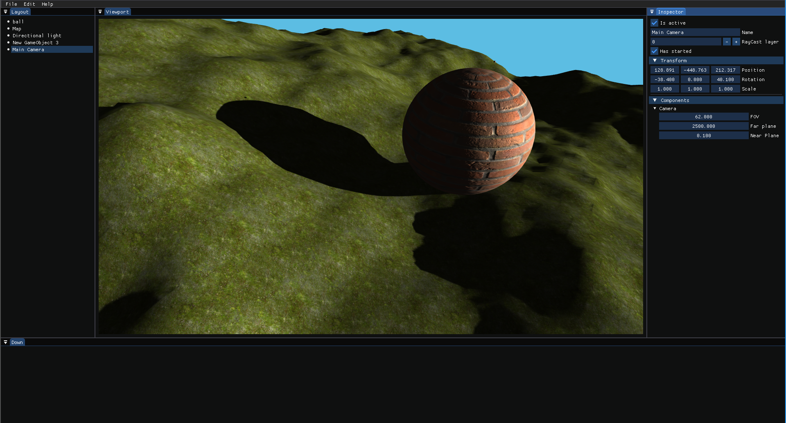

# RaphEngine2
RaphEngine2 is the second version of the original RaphEngine (as the name suggests).
It's a game engine, built to handle management games (in the style of cities skyline or transport fever).
The engine is multi-platform (Currently Windows + Linux).
For now, it uses OpenGL as the graphics API, but the graphics backend can be easely changed for another API.
To use the game engine a create your own game with it, I suggest you to take a look at the [RaphEngine2-example](https://github.com/RaphoufouLeFou/RaphEngine2-example) github. You will find a game example, and some more documentation (TODO).


## Features

As of today, the engine handle :
- Mesh/Texture loading
- LODs
- Smooth shadow and shadows LODs
- Raycasts
- Settings
- Customs shaders
- ImGui
- Logger
- The game loop
- Input system

And more little things.

## In the TODO list (Not in order)

- Add the UI (RmlUI)
- Spot and point lights
- Instancing
- Culling
- Add some skyboxes
- Handle big terrains
- Vegetation
- Smooth lod transitions
- Particle system
- Scene manager
- Bloom
- Terrain painting
- Sound system
- Animations
- Shader clouds
- God rays
- Add vulkan / D3D11 / D3D12
- Assets compressions
- Glass/Transparency
- Reflections

## Some screenshots




# Project status

The project is currently in developement. ETA: in a few years

# How to build

## Linux

### <ins>TLDR<ins>

To build shared library on linux, simply execute
```shell
./compile.sh
```

### <ins>Now if you want the detailed step, it's here:<ins>

To build the shared library, go to the root folder, and execute
```shell
cmake -B build
cmake --build build --target RaphEngine2
```
And then the .so file will be in `./build/RaphEngine2.so`

To build AND export the shared library, go to the root folder, and execute
```shell
cmake -B build -DCMAKE_INSTALL_PREFIX=/usr/local
sudo cmake --build build --target install
sudo ldconfig
```

To build the editor, go to the root folder, and execute
```shell
cmake -B build
cmake --build build
mv ./build/editor/RaphEditor ./
```

You can start the editor with `./RaphEditor`

## Windows

### <ins>TLDR<ins>

To build shared library on linux, simply execute
```shell
compile.bat
```

### <ins>Build the library<ins>

To build the .dll and .lib, go to the root folder, and execute
```shell
cmake -B build -G "Visual Studio 17 2022" -DCMAKE_INSTALL_PREFIX="path/to/librairy"
cmake --build build --config Release --target RaphEngine2
cmake --install build --config Release
```
__WARNING:__ Do not forget to replace `path/to/librairy` by a path for you librairy that your other project can access.
You can use `C:/RaphEngine2Install`, or whatever you want.
You can aso omit this argument, but will need root privilege to execute the last command, and to build your project

For debug build, replace the 2 instances of `--config Release` by `--config Debug` in the RaphEngine build, AND in your project.

When rebuilding the engine, you just need to execute the 2 last lines again.

### <ins>Build the editor<ins>

Building the editor is simmilar to builing the library. You just need to execute
```shell
cmake -B build -G "Visual Studio 17 2022"
cmake --build build --config Release
```

__WARNING:__ This will not export the library for your project. to build the editor and export the library, follow the steps of the "Build the library" section, and just remove the `--target RaphEngine2` argument.

For debug build, replace `--config Release` by `--config Debug`.

To run the editor, type `build\editor\Release\RaphEditor.exe`. (replace the `Release` part with `Debug` when building in debug mode).

If you move the executable in an other place, don't forget to also move the `RaphEngine2.dll` file.
